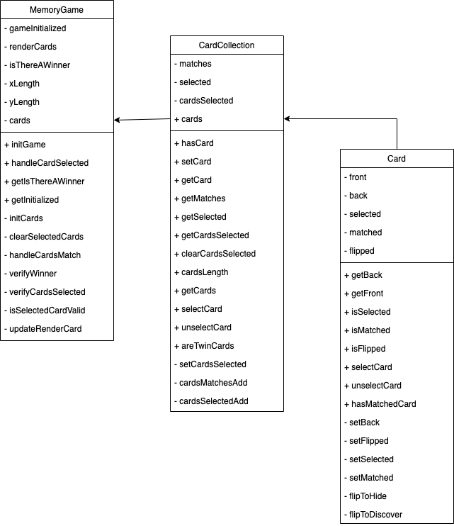

# memory-game

## Installing memory-game library

- To install memory-game library in your project just run the following command:

    ```
    npm i @tive-labs/memory-game
    ```

## Using memory-game library

1. ### Import the library

    - At the beginning of the js file in which you are going to use the library import as follows:

    ```js
    import memoryGame from @tive-labs/memory-game
    ```

2. ### Instantiate memoryGame

    - First of all it's necessary instantiate memoryGame as follows:

    ```js
    const mGame = memoryGame();
    ```

3. ### initGame

    - Next it's necessary initialize the game using the initGame method.

    ```js
    const init = mGame.initGame('animals', 'easy');
    ```

    - initGame receives two parameters, category and level.
        - Category must be 'animals' or 'numbers'
        - Level must be 'easy' or 'medium' or 'hard'

    - initGame returns an object with an array of hidden cards (cards), and the length of the array (xLength and yLength):

    ```js
    {
        cards,
        xLength,
        yLength
    }
    ```

4. ### selectCard

    - To play, it's necessary select cards to discover it using the handleCardSelected method.

    ```js
    let selected = mGame.handleCardSelected(0, 1);
    ```

    - handleCardSelected receives two parameters, position x and position y.
        - x must be a number representing the x position (vertical position) on the 2d array.
        - y must be a number representing the y position (horizontal position) on the 2d array.

    - handleCardSelected returns an object with three properties:

    ```js
    {
        cards,
        selectedCardData,
        cardMatch,
    }
    ```

    - cards: Contains the updated array of cards.
    - selectedCardData: Contains an object with the data of the discovered card (id, name, shortName)
    - cardMatch: Contains an object with a boolean value (isNewMatched) that indicates if exist a new card match, and an object (matchedCards) with the positions of the matched cards (x_y):
    
    ```js
    {
        isNewMatched,
        matchedCards: {
            firstCard,
            lastCard
        }
    }
    ```

5. ### Verify winner

    - Another way to verify if exist a winner is using the  getIsThereAWinner method.

    ```js
    let isThereAWinner = mGame.getIsThereAWinner()
    ```

6. ### Handling Errors

    - Use 'try catch' to handle errors:

    ```js
    try {
        let selected = mGame.handleCardSelected(0, 1);
    } catch(error) {
        console.log(error);
    }
    ```

## Class Diagram


